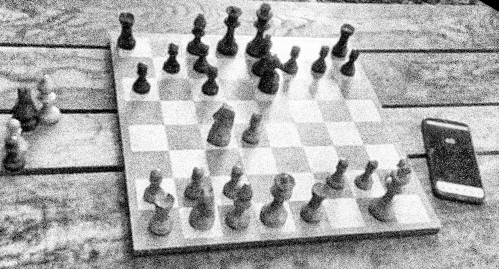

# Téléchecs

Play on [Lichess](https://lichess.org/) over the board, for cheap.

You can try it on https://pierremarc.github.io/telechecs/

## Publish

_rather a note for myself though_

`npm run build && git commit www/ -m 'Build' git subtree push --prefix www/telechecs origin pages`

## License

This "work" is written by Pierre Marchand and licensed under the [GNU Affero General Public License](https://www.gnu.org/licenses/agpl-3.0.en.html) version 3.
